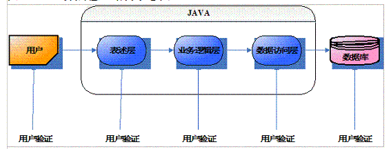

# Beautiful REST API

应用程序和 API 之间的交互中实际上只有3个结果：
  1. 一切正常
  2. API 错误
  3. 应用程序错误

当一切正常的情况下，API 响应只需要返回资源本身信息即可。当应用程序出错或 API 出错时我们需要将出现错误的问题信息返回给客户端，告知客户端发生了什么，并且该如何解决。

对应了下面三种数据响应格式

REST API 正常响应数据格式：

```http
HTTP/1.1 200 OK
Content-Type: application/problem+json
Content-Language: en

{
    "id": 778671998,
    "name": "mecode",
    "email": "778671998@qq.com"
}
```

API 错误（客户端导致,例如：客户端传递了无效的参数。）

```http
HTTP/1.1 400 BadRequest
Content-Type: application/problem+json
Content-Language: en

{
    "id": 778671998,
    "name": "mecode",
    "email": "778671998@qq.com"
}
```

应用程序错误（服务端导致，例如：应用程序内存溢出。）

```http
HTTP/1.1 400 BadRequest
Content-Type: application/problem+json
Content-Language: en

{
    "id": 778671998,
    "name": "mecode",
    "email": "778671998@qq.com"
}
```

## 目标

* GOAL#1 解决应用各层参数校验重复繁琐问题
  * [x] GOAL#1.1 表述层（表现层、Controller 层）
  * [ ] GOAL#1.2 业务逻辑层（服务层）
  * [ ] GOAL#1.3 数据访问层 (仓储层)
  


* 在表述层统一处理异常（全局异常处理），优化异常捕获策略（减少 try...catch 代码，改为自动抛出异常）。
    > 全局处理当然不会只能处理一种异常，用途也不仅仅是对一个参数校验方式进行优化。在实际开发中，如何对异常处理其实是一个很麻烦的事情。传统处理异常一般有以下烦恼：
    > 1. 是捕获异常(try...catch)还是抛出异常(throws)
    >  2. 是在controller层做处理还是在service层处理又或是在dao层做处理(在哪里处理)
    > 3. 处理异常的方式是啥也不做，还是返回特定数据，如果返回又返回什么数据（处理方式）
    > 4. 不是所有异常我们都能预先进行捕捉，如果发生了没有捕捉到的异常该怎么办？（如何处理未知异常）

* 通过自定义异常增加全局异常处理灵活性(自定义异常能携带更多的错误信息，而传统异常只能传递一个字符串)，并且自定义异常语义更明确，能更好的标识错误。
* 通过实现 RFC7807 规范（`Problem Detail`）统一 REST API 问题信息格式。
* 在表述层统一处理数据响应格式，减少使用 `Problem` 包装类的机会。
* 使 REST API 符合[理查森成熟度模型](https://martinfowler.com/articles/richardsonMaturityModel.html) 第二等级要求


## 示例
1. 应用各层参数校验重复繁琐问题举例


借助 `javax.validation.Valid` 注解实现

## 特征（Features）

## 信息参考

* [SpringBoot三招组合拳，手把手教你打出优雅的后端接口](https://mp.weixin.qq.com/s/waPatEnrFnStcfa9Z1RZsQ)
* [概述 Bean Validation 规范](https://developer.ibm.com/zh/articles/j-lo-beanvalid/)

## 规范引用

* [JSR303](https://beanvalidation.org/1.0/spec/)