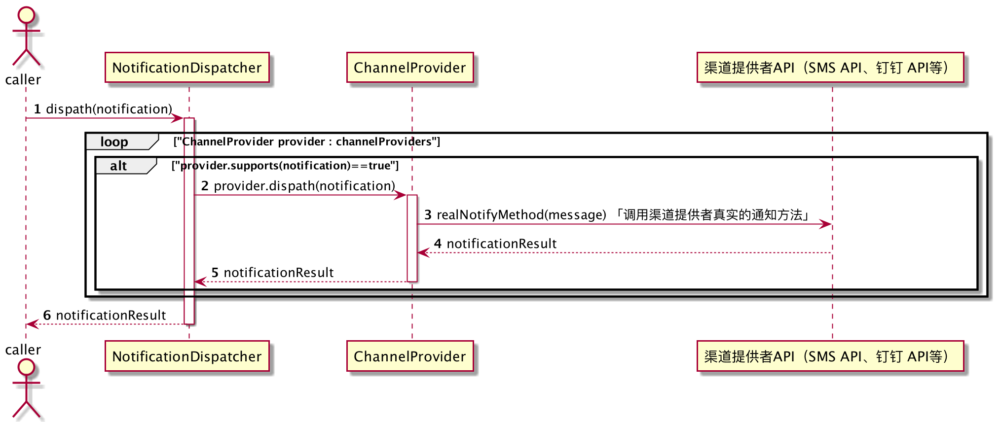

# 消息通知组件设计

## 消息的生命周期


一条消息通常由“业务系统”产生，并经由「消息通知组件」（聚合多种通知渠道短信、企业微信、站内消息、钉钉等）根据不同类型的消息选择相应的消息通知渠道进行消息发送，最后经过「终端设备」(手机、PC、平板)传递到消费者面前，从而被消费者消费。

消息的生命周期粗略可分为以下三个阶段：

1. 生产消息
2. 发送消息
3. 消费消息

## 概念模型

## 消息通知机制

> 本消息通知机制，采用同步消息通知模式，暂未考虑引进异步消息通知模式。


TODO...

## 程序设计

### 核心类介绍

| 名称                          | 类型 | 描述                                                         |
| ----------------------------- | ---- | ------------------------------------------------------------ |
| Notification                  | 接口 | 通知接口，所有类型的通知都需要实现 `Notification`            |
| Message                       | 接口 | 消息接口，所有类型的消息都需要实现 `Message`                 |
| **ChannelProvider**               | 接口 | 渠道提供者接口，负责处理 `Notification`、`Message` 。开发者需要实现该 `ChannelProvider` 接口。 |
| NotificationDispatcher        | 接口 | 通知调度器接口。 |
| DefaultNotificationDispatcher | 类   | 默认的通知调度实现类。                                        |


### 类图


### 时序图




**DefaultNotificationDispatcher 实现代码**

```java
package com.highzap.notification.core;

import org.springframework.beans.BeansException;
import org.springframework.context.ApplicationContext;
import org.springframework.util.Assert;
import java.util.Collection;
import java.util.Map;
import java.util.Optional;

public class DefaultNotificationDispatcher implements NotificationDispatcher<Notification> {

    private Collection<ChannelProvider> channelProviders;

    @Override
    public Optional<Object> dispatch(Notification notification) {

        Assert.state(channelProviders != null, "channelProviders cannot be null!");

        for (ChannelProvider provider : channelProviders) {
            if (provider.supports(notification)) {
                return provider.dispatch(notification);
            }
        }

        return Optional.empty();
    }

    @Override
    public void setChannelProviders(Collection<ChannelProvider> providers) {
        if (providers != null) {
            this.channelProviders = providers;
        }
    }

    @Override
    public void setApplicationContext(ApplicationContext applicationContext) throws BeansException {
        Map<String, ChannelProvider> beansOfType = applicationContext.getBeansOfType(ChannelProvider.class);
        setChannelProviders(beansOfType.values());
    }
}

```

### 消息通知扩展方式

如果想要扩展消息通知类型，可以通过以下步骤来完成
1. 实现自定义 `Message`
2. 实现自定义 `Notification`
3. 实现自定义 `ChannelProvider`

以企业微信消息通知为例分别实现：
1. `BaseMessage` 实现 `Message`
2. `WeChatNotification` 实现 `Notification`
3. `WeChatChannelProvider` 实现 `ChannelProvider`

`BaseMessage` 微信基础消息类（包含公共字段）

```java
public abstract class BaseMessage implements Message {
    private List<String> touser;
    private List<String> toparty;
    private List<String> totag;
    private int toall;
    private int agentid;
    private int safe;
    // ... 省略公共的 Getter、Setter 方法
    public abstract String getMsgType();
}
```

`Text` 文本类

```java
public class Text {
    private String content;
}
```

`TextMessage` 文本消息类

```java
public class TextMessage extends BaseMessage {
    private Text text;

    @Override
    public String getMsgType() {
        return "text";
    }
}
```

`WeChatNotification` 微信消息通知类

```java
public class WeChatNotification implements Notification<BaseMessage> {
    // 通知类型常量值
    private final static String NOTIFICATION_TYPE = "WECHAT";

    private BaseMessage message;

    @Override
    public BaseMessage getMessage() {
        return message;
    }

    @Override
    public String getType() {
        return NOTIFICATION_TYPE;
    }

    public void setMessage(BaseMessage message) {
        this.message = message;
    }
}

```

`WeChatChannelProvider` 微信消息通知渠道提供者类，该类负责与微信 SDK 进行集成，此处不做介绍。
> 参见：[企业微信应用消息推送 API 文档](https://open.work.weixin.qq.com/api/doc/90000/90135/90250)

```java
// 通过 @Component 注解将 Bean 加入 Spring Context 中。
@Component
public class WeChatChannelProvider implements ChannelProvider {

    @Override
    public Optional<Object> dispatch(Notification notification) {
        // 获取到消息通知信息。
        WeChatNotification weChatNotification = (WeChatNotification) notification;
        // 从通知获取消息主体准备数据。
        BaseMessage message = weChatNotification.getMessage();
        // 此处调用微信 SDK 提供的 API 发送消息通知。
        
        // 根据具体情况返回消息通知返回值，若没有返回值可以直接返回 `Optional.empty()`
        return Optional.empty();
    }

    @Override
    public boolean supports(Notification notification) {
        return WeChatNotification.class.equals(notification.getClass());
    }
}
```

实现完成以上步骤后，即完成消息通知类型的扩展。

单元测试示例代码：
```java
class NotificationDispatcherTest {

    static NotificationDispatcher<Notification> dispatcher = new DefaultNotificationDispatcher();

    @BeforeAll
    public static void initialize() {
        dispatcher.setChannelProviders(Arrays.asList(new SmsChannelProvider(), new WeChatChannelProvider()));
    }
    
    @Test
    void dispatch_WeChat_Success() {

        // Given
        TextMessage message = new TextMessage();
        WeChatNotification weChatNotification = new WeChatNotification();
        weChatNotification.setMessage(message);

        // When
        Optional<Object> reuslt = dispatcher.dispatch(weChatNotification);

        // Then
        assertTrue(reuslt.isPresent());
        assertNotNull(reuslt.get());
    }
}
```

## 组件调用

调用方式有两种：
1. Notification SDK
2. Notification Microservice

SDK 的集成方式是将 `Notification SDK` 打包成一个 `Maven Dependency` ，托管到 Maven 私服，其他业务系统通过引入 `Maven Dependency` 的方式进行集成，从而直接通过类调用 `Notification SDK` 
提供的 `API`。 

Microservice 的集成方式是将 `Notification` 构建成一个 `Image`，部署到业务系统所在的微服务网络中，然后通过 `Notification` 微服务提供的 `Endpoint` 进行 `REST` 调用，从而达到消息通知的目的。

