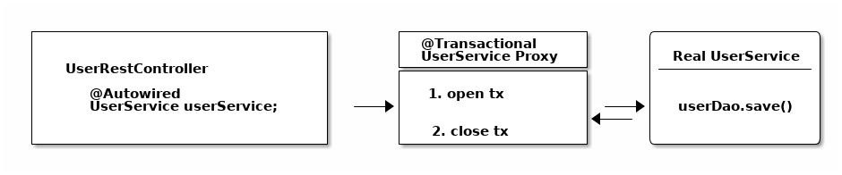

## 银行转账案例

张三向李四的账户上转 1000 元。

具体操作步骤：

1. 系统: 检查张三账户余额是否大于等于 1000。
2. 系统: 扣除张三账户余额 1000。
3. 系统: 增加李四账户余额 1000。

## JDBC 事务

处理步骤：

1. 配置数据源并获取一个到数据库的连接；
2. 关闭数据库事务的自动提交；
3. 执行一些 SQL 语句；
4. 提交数据库事务；
5. 如果在第 3 步，发生例外，则回滚数据库事务；
6. 关闭数据库连接。

```java
public class UserService {
    public void transfer() throws SQLException {
        Connection connection = dataSource.getConnection();//(1)
        try {
            connection.setAutoCommit(false); // (2)
            // execute some SQL statements... (3)
            connection.commit(); //(4)
        } catch (SQLException ex) {
            connection.rollback(); //(5)
        } finally {
            connection.close(); //(6)
        }
    }
}
```

## Spring 指令式事务管理

```java

@Service
public class UserService {

    @Autowired
    private TransactionTemplate template;

    public Long registerUser(User user) {
        Long id = template.execute(status -> {
            // execute some SQL that e.g.
            // inserts the user into the db and returns the autogenerated id
            return id;
        });
    }
}
```

与 JDBC 的示例相比，

1. 不需要显式的管理数据库连接；
2. 不需要显式的管理事务的提交和回滚，只需要传一个[事务回调函数](https://docs.spring.
   io/spring-framework/docs/current/javadoc-api/org/springframework/transaction/support/TransactionCallback.html)
3. 不需要捕获处理 SQLException， Spring 会将这些异常转换为运行时异常（如何转换的？）。

## @Transactional

```java
public class UserService {

    @Transactional
    public Long registerUser(User user) {
        // execute some SQL that e.g.
        // inserts the user into the db and retrieves the autogenerated id
        // userDao.save(user);
        return id;
    }
}
```

@Transactional 注解后的最终会被转换成如下（简化的）：

```java
public class UserService {

    public Long registerUser(User user) {
        Connection connection = dataSource.getConnection(); // (1)
        try (connection) {
            connection.setAutoCommit(false); // (1)

            // execute some SQL that e.g.
            // inserts the user into the db and retrieves the autogenerated id
            // userDao.save(user); <(2)

            connection.commit(); // (1)
        } catch (SQLException e) {
            connection.rollback(); // (1)
        }
    }
}
```

（1）JDBC 的标准打开和关闭代码，这些 Spring 会自动完成，你不需要显式的编写这些代码。
（2）这里你可以使用 Dao 或其他类似的代码来保存用户。

## CGlib & JDK Proxies - @Transactional 工作机制

Spring 无法像上面那样真正重写您的 Java 类来插入连接代码。

从图中可以看到代理只做了一项工作：

* 打开和关闭数据库连接/事务
* 然后委托给你编写的真实的 `UserService`


物理事务 vs. 逻辑事务


### 事务传播模式

| Propagation   |              |      |
| ------------- | ------------ | ---- |
| REQUIRED      | 必需的       |      |
| SUPPORTS      | 支持         |      |
| MANDATORY     | 强制的       |      |
| REQUIRES_NEW  | 需要新的事务 |      |
| NOT_SUPPORTED | 不支持       |      |
| NEVER         | 从不         |      |
| NESTED        | 嵌套         |      |

### 事务隔离级别

## 常见的 @Transactional 陷阱

